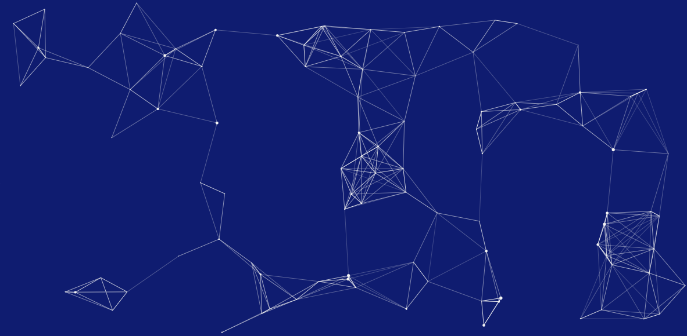

<h1>
 Hey there! I'm Abdulbasit. 
</h1>

<h3> 👨🏻‍💻 &nbsp;About Me </h3>

- 🤔 &nbsp; Full MERN Stack Developer ;
- 🎓 &nbsp; Studying Physiology at University of Ibadan ;
- 🌱 &nbsp; Learing Web Development and Medics in deep;
- ✍️ &nbsp; Learning App and Software Development ;

<h3> 🛠 &nbsp;Languages and Tools</h3>

- 💻 &nbsp;
  
- 🌐 &nbsp;
  
  
  
  
  
  
  
  
   
- 🛢 &nbsp;
  
- ⚙️ &nbsp;
  
  
- 🔧 &nbsp;
  

 

<h3> 🤝🏻 &nbsp;Reach Me </h3>

  
  

<i>Random Programming joke for you</i> 

